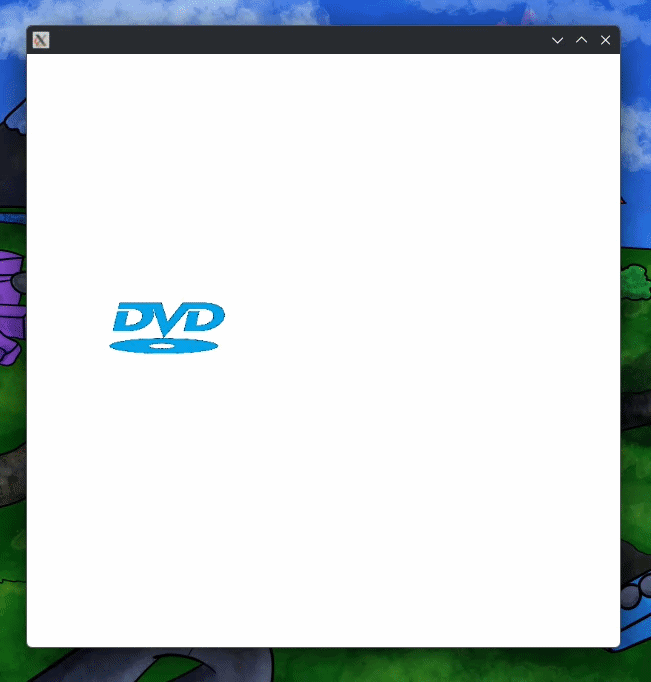

# DVD Logo Example

Ever fell asleep while watching a DVD?
Then wake up to the DVD logo bouncing around the screen?
This example shows how to create a simple DVD logo animation.

## Create the Project

Create the project using the following command:

```bash
# Create the project
mvn archetype:generate -DarchetypeGroupId=org.openjfx -DarchetypeArtifactId=javafx-archetype-simple
# Navigate to the project directory
cd DVDLogo
# Run the project
mvn clean javafx:run
```

## Finish the Project


