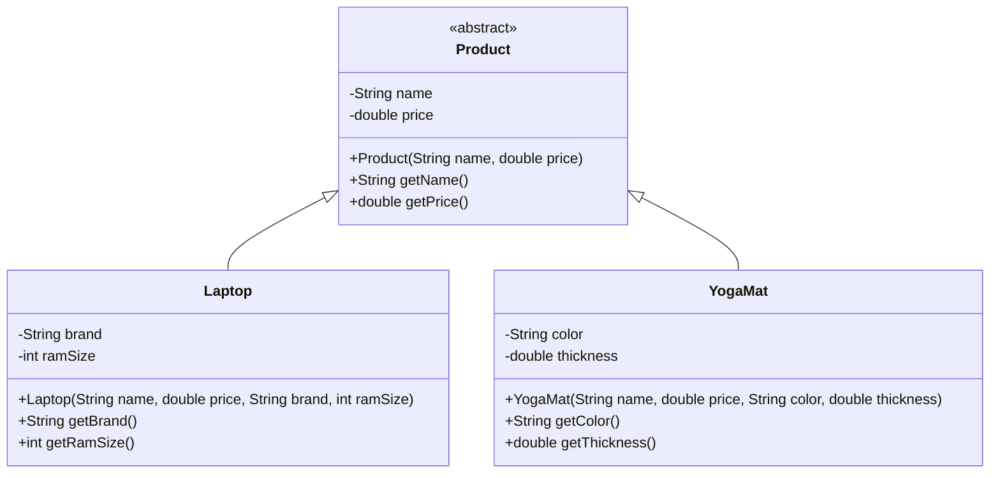

# LU03 Inheritance

Inheritance is a fundamental concept in object-oriented programming (OOP) that allows a class to inherit properties and behaviors (methods) from another class.

- [Java Docs: Inheritance](https://docs.oracle.com/javase/tutorial/java/IandI/subclasses.html)

## Slides

[Inheritance Slides](slides.html)

## Create the Project

```bash
mvn archetype:generate -DgroupId=org.example -DartifactId=my-app -DarchetypeArtifactId=maven-archetype-quickstart -DarchetypeVersion=1.5 -DinteractiveMode=false
```

Run the project with the following command:

```bash
mvn compile exec:java -Dexec.mainClass="org.example.App"
```

## Inheritance Diagram

<!-- Product -> Laptop -->
<!-- Product -> YogaMat --> -->


