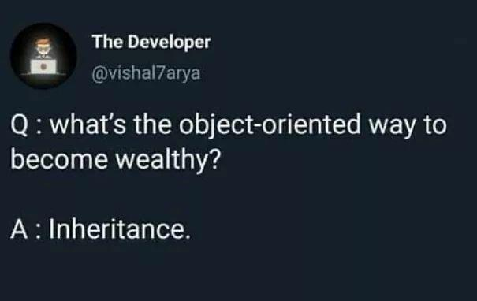

# Inheritance in Java

- Luke Matheis

---

## The basic idea

Inheritance lets one class build on another class.

```text
Animal
  |
  +-- Dog
  +-- Cat
```

- `Animal` is the **superclass** (or parent class)
- `Dog` is a **subclass** (or child class)
- A dog **is an** animal

> Use inheritance when the relationship is genuinely **is-a**.

---

## A superclass provides common behavior

```java
class Animal {
	void eat() {
		System.out.println("The animal eats.");
	}

	void sleep() {
		System.out.println("The animal sleeps.");
	}
}
```

`Animal` describes behavior shared by many kinds of animals.

---

## Creating a subclass

```java
class Dog extends Animal {
	void bark() {
		System.out.println("The dog barks.");
	}
}
```

---

## Using the subclass

`Dog` gets access to the inherited `eat()` and `sleep()` methods.

```java
Dog dog = new Dog();
dog.eat();   // inherited
dog.sleep(); // inherited
dog.bark();  // Dog's own method
```

---

## What is inherited?

Subclasses can use accessible members from their superclass:

| Member                         | Inherited?                              |
| ------------------------------ | --------------------------------------- |
| `public` methods and fields    | Yes                                     |
| `protected` methods and fields | Yes                                     |
| `private` members              | No direct access                        |
| constructors                   | No, but they can be called with `super` |

Inheritance does not copy private implementation details into the subclass API.

---

## Constructors and `super`

The superclass constructor runs before the subclass constructor.

```java
class Animal {
	Animal(String name) {
		System.out.println("Animal: " + name);
	}
}

class Dog extends Animal {
	Dog(String name) {
		super(name); // call Animal's constructor
		System.out.println("Dog created");
	}
}
```

`super(...)` must be the first statement in the subclass constructor.

---



---
