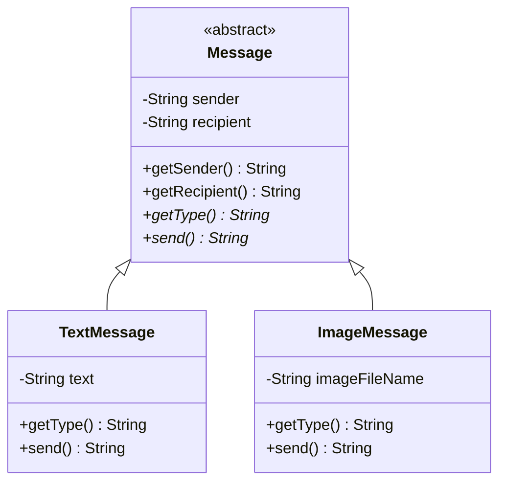

# EXTRA LECTURE: Polymorphism Review

```bash
mvn archetype:generate -DarchetypeGroupId=org.openjfx -DarchetypeArtifactId=javafx-archetype-simple
mvn clean javafx:run
```

## Model


```mermaid
classDiagram
    class Message {
        <<abstract>>
        -String sender
        -String recipient
        +getSender() String
        +getRecipient() String
        +getType() String*
        +send() String*
    }
    class TextMessage {
        -String text
        +getType() String
        +send() String
    }
    class ImageMessage {
        -String imageFileName
        +getType() String
        +send() String
    }
    Message <|-- TextMessage
    Message <|-- ImageMessage
```
