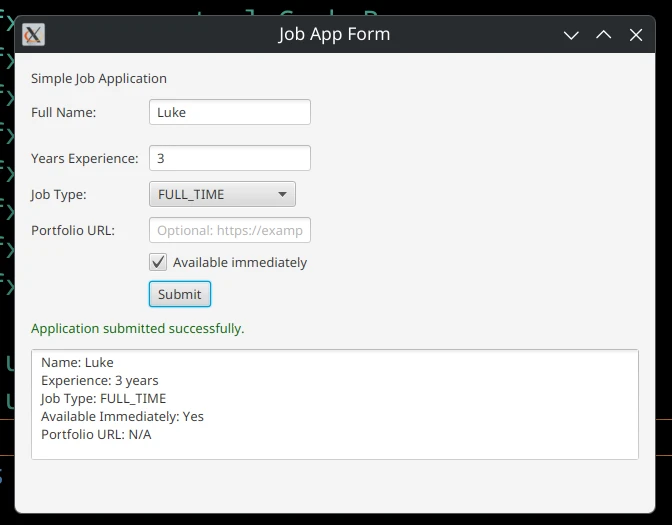
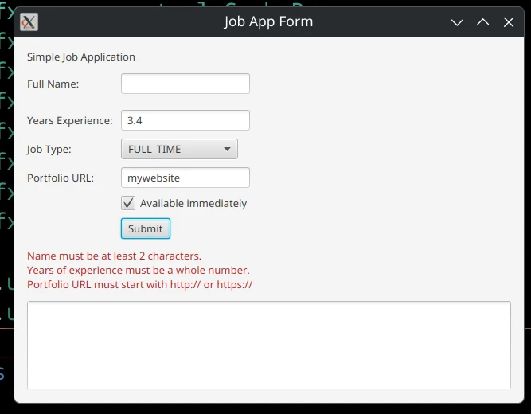

# Custom Exception with JavaFX Example

Todays lecture will refresh on JavaFx forms.
We will allow the user to fill out a job application form, and we will validate the input using custom exceptions.
We **won't** crash the program if the user enters invalid data, instead we will show them a list of errors that they need to fix before they can submit the form.

